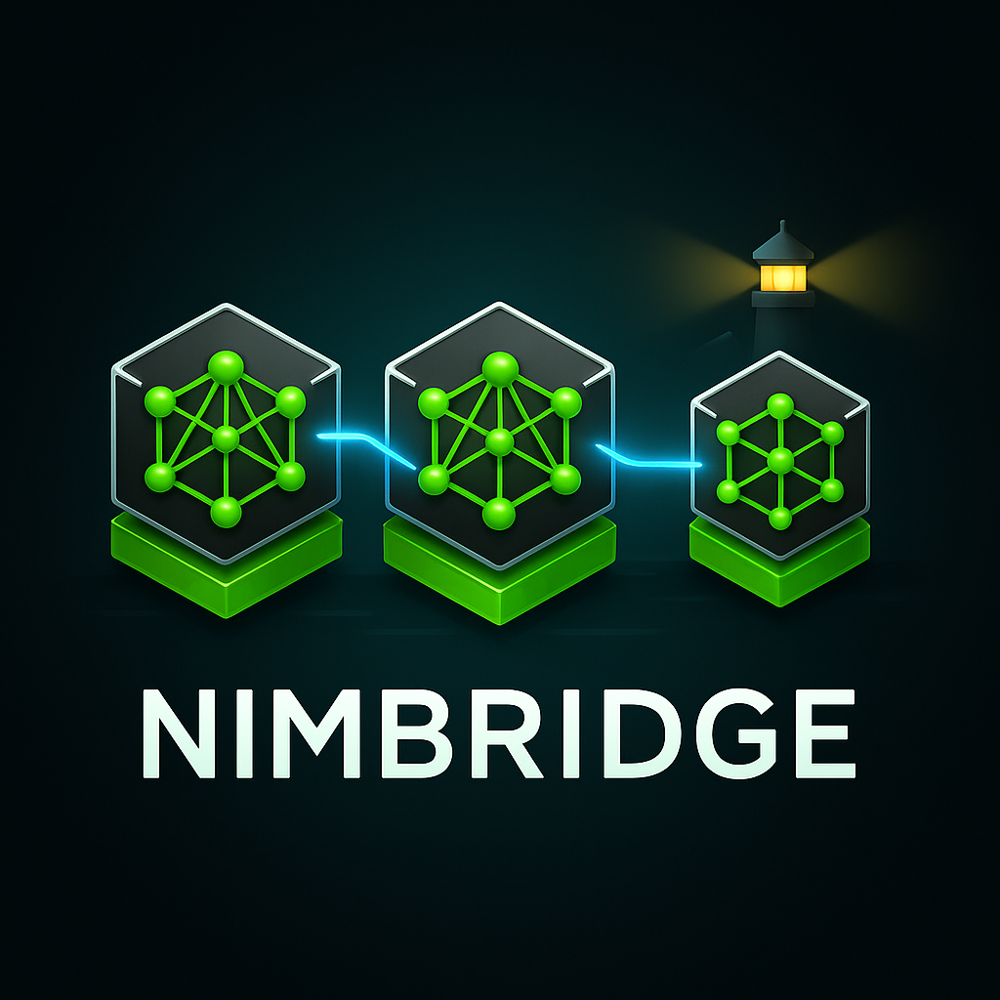

<div align="center">




**Hybrid Kubernetes + Azure GPU Platform for AI Inference**

[](https://azure.microsoft.com)
[](https://kubernetes.io)
[](https://nvidia.com)
[](https://docs.nvidia.com/nim/)
[](https://terraform.io)
[](https://goharbor.io)

*On-premise Kubernetes cluster connected to Azure GPU infrastructure for scalable AI model inference using NVIDIA NIM microservices*

</div>

---

## Overview

NIMBRIDGE demonstrates a modern hybrid cloud architecture:
- **On-Premise**: Kubernetes cluster + Harbor registry (proxy-cache)
- **Cloud**: Azure Container Registry + GPU Container Apps
- **AI Models**: NVIDIA NIM (Llama3-8B) for inference

**Use Case**: Run AI workloads locally while leveraging cloud GPU when needed, with intelligent image caching via Harbor.

---

## Prerequisites

- Linux server with Kubernetes (Kind/K3s/native)
- Azure account with free credits
- NVIDIA NGC account ([sign up here](https://ngc.nvidia.com))
- `kubectl`, `helm`, `docker` installed

---

## Quick Start

### Step 1: Azure Infrastructure

Creates Azure Container Registry and Container Apps environment.
```bash
./setup-azure.sh
```

**Time**: 3-5 minutes | **Cost**: ~8€/month (idle)

### Step 2: Push NVIDIA NIM Model

Requires NGC API key from https://ngc.nvidia.com
```bash
export NGC_API_KEY="your-key-here"
./push-nim-image.sh
```

**Time**: 5-10 minutes (large download)

### Step 3: Deploy Harbor

Installs Harbor registry on your Kubernetes cluster.
```bash
./setup-harbor.sh
```

**Time**: 2-3 minutes

### Step 4: Configure Proxy-Cache

Sets up Docker Hub, NVIDIA NGC, and Azure ACR endpoints in Harbor.
```bash
./configure-harbor.sh
```

**Time**: 30 seconds

---

## Architecture
```
┌─────────────────────────────┐
│   On-Premise Kubernetes     │
│  ┌──────────┐               │
│  │  Harbor  │ Proxy Cache   │
│  └────┬─────┘               │
└───────┼─────────────────────┘
        │
        ├─── Docker Hub
        ├─── NVIDIA NGC
        └─── Azure ACR
                │
        ┌───────▼──────────────┐
        │   Azure Cloud        │
        │  ┌────────────────┐  │
        │  │ Container Apps │  │
        │  │   GPU (NIM)    │  │
        │  └────────────────┘  │
        └──────────────────────┘
```

---

## Verification

**Check Azure resources:**
```bash
cd terraform && terraform output
```

**Check Harbor status:**
```bash
kubectl get pods -n harbor
```

**Test Harbor registries:**
```bash
kubectl run test --rm -it --image=curlimages/curl --restart=Never -- \
  curl -u admin:Nimbridge2024! \
  http://harbor-core.harbor.svc.cluster.local/api/v2.0/registries
```

---

## What's Created

| Component | Description | Location |
|-----------|-------------|----------|
| Azure Resource Group | Container for Azure resources | Cloud |
| Azure Container Registry | Private Docker registry | Cloud |
| Log Analytics | Monitoring and logs | Cloud |
| Container App Environment | GPU runtime environment | Cloud |
| Harbor Registry | Proxy-cache + image storage | On-Prem |

---

## Project Structure
```
nimbridge/
├── setup-azure.sh          # Azure infrastructure
├── push-nim-image.sh       # NVIDIA NIM image
├── setup-harbor.sh         # Harbor deployment
├── configure-harbor.sh     # Registry config
├── terraform/
│   ├── main.tf
│   ├── variables.tf
│   └── providers.tf
└── helm/
    └── harbor/
        └── values.yaml
```

---

## Troubleshooting

**Azure CLI fails to install:**
```bash
sudo rm -f /etc/apt/sources.list.d/azure-cli.sources
sudo apt update
```

**Harbor pods stuck:**
```bash
kubectl get storageclass  # Verify storage class name
# Update helm/harbor/values.yaml if needed
```

**Provider registration timeout:**
```bash
az provider register --namespace Microsoft.App --wait
```

---

## Cleanup

**Remove Harbor:**
```bash
helm uninstall harbor -n harbor
kubectl delete namespace harbor
```

**Remove Azure resources:**
```bash
cd terraform && terraform destroy
```

---

## Credentials

- **Harbor**: `admin` / `Nimbridge2024!`
- **Azure ACR**: Auto-generated (from Terraform output)

---

## Next Steps

- [ ] Deploy FastAPI gateway on Kubernetes
- [ ] Create GPU Container App for NIM inference
- [ ] End-to-end inference testing
- [ ] Add monitoring with Prometheus/Grafana

---

## License

MIT License - See [LICENSE](LICENSE) for details

---

<div align="center">

**Built with** Terraform • Kubernetes • NVIDIA NIM • Azure • Harbor

</div>
